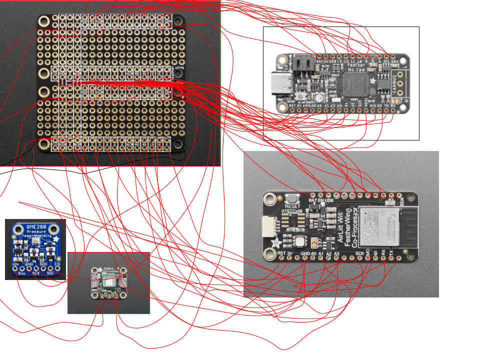

# IoT Air Pollution Monitor
An Air Pollution Monitor that uses the API, Adafruit IO, in order to store air quality data and other things about the air. This monitor uses CircuitPython to track air quality with the sensor.

| **Engineer** | **School** | **Area of Interest** | **Grade** |
|:--:|:--:|:--:|:--:|
| Isaac H. | BASIS Independent Silicon Valley | Electrical Engineering | Incoming Sophmore


# Modifications

## Modification 4
The last modification I made was adding a CO2 sensor. I mainly choose this sensor because it had a library on circuitpython and because I didn't have to order it online. Eventhough it could measure temperature and humidity, I decided not to use those functions because they were already being used on the BME280. This was the most simple modification that I implemented and the one I spent the least time one. This was the most interesting modification since I never knew what CO2 was measured in, and it taught me more about how much CO2 thou can breathe in before thee dies.

## Modification 3 (Scrapped)
The third modification I attempted was a notification system. I tried using email at first but the device didn't have enough ram. Then, I tried using two different sms api, but I was using circuitpython, and the libraries for the api required me to use pip. As a result, I was unable to implement a notification system mainly because of the hardware. But, while trying to add a notification system, I learned that thou is more likely to die in hot humid weather than hot dry weather, and the air pressure required to kill thee.

## Modification 2
The second modification I did was an enclosure, although this wasn't the last modification I did, it was the one that I completed last. The enclosure was a simple open box with holes for the sensors and the micro-usb, with a friction fit lid for the top. The box and the lid took me 3 tries to get it right. For the box, I decided to make it just wide enough for the featherwing doubler to fit in, but I made it a lot longer in order to fit in the other sensors and adaptors. The 2nd lid fit in pretty well on the first time, but after a few more uses, it became loose, so I had to make another one. The 2nd box also fit pretty well, but there was only a hole for one sensor, so I had to add more holes in the back for the sensors.

## Modification 1
The first modification I tried to do was altering to the code, the alteration allowed the device to take a measurements of the air each minute and take the average and submit the average to the website instead of an instantaneous measurement. Unlike some of the other modifications, this one went pretty smoothly.
  
# Final Milestone

<!-- For your final milestone, explain the outcome of your project. Key details to include are:
- What you've accomplished since your previous milestone
- What your biggest challenges and triumphs were at BSE
- A summary of key topics you learned about
- What you hope to learn in the future after everything you've learned at BSE -->

<iframe width="560" height="315" src="https://www.youtube.com/embed/0_yikpJzIDs?si=x4FFdHIlrD__UCiN" title="YouTube video player" frameborder="0" allow="accelerometer; autoplay; clipboard-write; encrypted-media; gyroscope; picture-in-picture; web-share" referrerpolicy="strict-origin-when-cross-origin" allowfullscreen></iframe>

## Summary
The device now uses all its sensors to collect data about the air and it is capable of sending this data to Adafruit IO. It collects data from the air every 10 minutes and sends it to the Adafruit website.

## Challenges
Reaching this goal was somewhat difficult, the code I had for the device used the same pin for reset and communcation between the Feather M4 Express and the FeatherWing AirLift. For some reason, all the libraries also used had this same issue, so I had to alter the libraries to fix this issue. I also had to solder the reset pin to somewhere else. But after that was done, all the problems were fixed.

## Next Steps
The next thing I'll be doing is altering the code so the device collects data about the air every minute and takes the average of those data points and sends it to the Adafruit website.

# Second Milestone

<iframe width="560" height="315" src="https://www.youtube.com/embed/CwujE-ylHDU?si=MmB4RtnLt_hvgHlD" title="YouTube video player" frameborder="0" allow="accelerometer; autoplay; clipboard-write; encrypted-media; gyroscope; picture-in-picture; web-share" referrerpolicy="strict-origin-when-cross-origin" allowfullscreen></iframe>

## Summary
For my second milestone, I got my IoT Air Pollution Monitor connected to Adafruit IO. Thanks to this, I now know that the device is capable of sending data to Adafruit IO. I used a feed called test to try testing if the device could send data to the Adafruit IO website. For some reason, it would randomly disconnect at times, but it clearly works.

## Challenges
At first, the device would not connect to the internet. Turns out, the code from the guide did not work properly. I had to alter it a bit before it would connect to the internet, I had to go find the libraries several times. Some of the code was wrong as it used the wrong pins, so I had to alter that and check the instructions for where all the pins were at. It was only then when I finally got the problem fixed.

## Next Steps
Since I know I can connect the device to Adafruit IO, I will try and complete this project and get all the sensors working.

# First Milestone

<iframe width="560" height="315" src="https://www.youtube.com/embed/B4W-5G_TOrQ?si=48rKr00MQ13I0MSI" title="YouTube video player" frameborder="0" allow="accelerometer; autoplay; clipboard-write; encrypted-media; gyroscope; picture-in-picture; web-share" referrerpolicy="strict-origin-when-cross-origin" allowfullscreen></iframe>

## Summary
My main project was an IoT Air Pollution Monitor, it uses several components to track data about the air. The BME280 tracks temperature and humidity, while the PM2.5 AQI sensor tracks the air quality. The Adafruit Feather M4 express processes all this data and sends it to the Adafruit FeatherWing AirLift to send data to the Adafruit IO. And the breadboard adapter allows the PM2.5 AQI sensor to send data to the Feather M4 Express. All these components would not work together without the FeatherWing Doubler, as it connects the Feather M4 Express to the FeatherWing AirLift, and the two Sensors to the Feather M4 Express.

## Progress and Challenges
So far, I've assembled all the parts together and set up a dashboard on the Adafruit IO website when data gets sent there. The only challenged I faced was soldering, as some of the pins were very long, which made the soldering more difficult. When trying to solder the adapter to the FeatherWing Doubler, it had solder in all of it's ports, so I had to try and get all the solder out. I made many mistakes on the FeatherWing Doubler, but I ended up fixing it with the solder wick and solder sucker.

## Plans
Since the assembly is complete, the next step for me will be connecting the Air Pollution Monitor to the internet. 

# Starter Project: Calculator

<iframe width="560" height="315" src="https://www.youtube.com/embed/WKYSBbCFJjI?si=-xpv9teLWwa9nqml" title="YouTube video player" frameborder="0" allow="accelerometer; autoplay; clipboard-write; encrypted-media; gyroscope; picture-in-picture; web-share" referrerpolicy="strict-origin-when-cross-origin" allowfullscreen></iframe>

## Summary
This starter project was a calculator, it contains a battery and uses two four digit digital tube display. All the math is done by the controller and the buttons input numbers into the controller. I chose this because I wanted to learn how calculators work, and because it is an everyday item.

## Challenges
Overall, this starter project did not have many challenges, but because some of the steps were done in the wrong order, the controller socket was misaligned. I had to bend the pins of the controller in order to fit it in because the socket was misaligned.

## What's Next
My next project will be the IoT Air Quality Monitor, it uses a BME280 and PM2.5 Sensor to track air quality and things related to air quality. The device uses a AirLift FeatherWing WiFi Co-Processor to connect to the WiFi and the Adafruit Feather M4 Express to process the data.

# Schematics


<!-- # Schematics 
Here's where you'll put images of your schematics. [Tinkercad](https://www.tinkercad.com/blog/official-guide-to-tinkercad-circuits) and [Fritzing](https://fritzing.org/learning/) are both great resoruces to create professional schematic diagrams, though BSE recommends Tinkercad becuase it can be done easily and for free in the browser. -->

# Code
Here's the code for my project:

```python
import time
import board
import busio
from digitalio import DigitalInOut, Direction, Pull
from adafruit_esp32spi import adafruit_esp32spi, adafruit_esp32spi_wifimanager
from adafruit_io.adafruit_io import IO_HTTP
from simpleio import map_range
from adafruit_pm25.uart import PM25_UART
from adafruit_bme280 import basic as adafruit_bme280
import supervisor
import gc
import adafruit_pm25
import adafruit_bme280
from adafruit_bme280 import basic as adafruit_bme280
import adafruit_scd4x
#from adafruit_bme280 import Adafruit_BME280_I2C

print("xasdasd")

def mean(x):
    average = 0.0
    for i in range(len(x)):
        average += x[i]
    average /= len(x)
    return average

# Sensor Functions
def get_aqi_category(aqi_data):
    aqi_cat = "N/A"
    aqi_average = mean(aqi_data)
    if 0.0 <= aqi_average <= 12.0:
        aqi_cat = "Good"
    elif 12.1 <= aqi_average <= 35.4:
        aqi_cat = "Moderate"
    elif 35.5 <= aqi_average <= 55.4:
        aqi_cat = "Unhealthy for Sensitive Groups"
    elif 55.5 <= aqi_average <= 150.4:
        aqi_cat = "Unhealthy"
    elif 150.5 <= aqi_average <= 250.4:
        aqi_cat = "Very Unhealthy"
    elif 250.5 <= aqi_average <= 350.4:
        aqi_cat = "Hazardous"
    elif 350.5 <= aqi_average <= 500.4:
        aqi_cat = "Hazardous"
    return aqi_cat

def calculate_aqi(pm_sensor_reading):
    """Returns a calculated air quality index (AQI)
    and category as a tuple.
    NOTE: The AQI returned by this function should ideally be measured
    using the 24-hour concentration average. Calculating a AQI without
    averaging will result in higher AQI values than expected.
    :param float pm_sensor_reading: Particulate matter sensor value.

    """
    # Check sensor reading using EPA breakpoint (Clow-Chigh)
    try:
        if 0.0 <= pm_sensor_reading <= 12.0:
            # AQI calculation using EPA breakpoints (Ilow-IHigh)
            aqi_val = map_range(int(pm_sensor_reading), 0, 12, 0, 50)
        elif 12.1 <= pm_sensor_reading <= 35.4:
            aqi_val = map_range(int(pm_sensor_reading), 12, 35, 51, 100)
        elif 35.5 <= pm_sensor_reading <= 55.4:
            aqi_val = map_range(int(pm_sensor_reading), 36, 55, 101, 150)
        elif 55.5 <= pm_sensor_reading <= 150.4:
            aqi_val = map_range(int(pm_sensor_reading), 56, 150, 151, 200)
        elif 150.5 <= pm_sensor_reading <= 250.4:
            aqi_val = map_range(int(pm_sensor_reading), 151, 250, 201, 300)
        elif 250.5 <= pm_sensor_reading <= 350.4:
            aqi_val = map_range(int(pm_sensor_reading), 251, 350, 301, 400)
        elif 350.5 <= pm_sensor_reading <= 500.4:
            aqi_val = map_range(int(pm_sensor_reading), 351, 500, 401, 500)
        else:
            print("Invalid PM2.5 concentration")
            aqi_val = -1
        return aqi_val
    except (ValueError, RuntimeError, ConnectionError, OSError) as e:
            print("Unable to read from sensor, retrying...")
            supervisor.reload()


def sample_aq_sensor():
    """Samples PM2.5 sensor
    over a 2.3 second sample rate.

    """
    try:
        aq_reading = 0
        aq_samples = []

        read_tries = 0
        read_attempt_limit = 5


        # initial timestamp
        time_start = time.monotonic()
        # sample pm2.5 sensor over 2.3 sec sample rate
        while (time.monotonic() - time_start) <= 2.3:
            try:
                aqdata = pm25.read()
                print("Read pm25")
                aq_samples.append(aqdata["pm25 env"])
                break
            except RuntimeError:
                print("RuntimeError while reading pm25, trying again. Attempt: ", read_tries)
                read_tries += 1
                time.sleep(0.1)
        if read_tries >= read_attempt_limit:
            raise RuntimeError
            # pm sensor output rate of 1s
            time.sleep(3)
        # average sample reading / # samples
        try:
            for sample in range(len(aq_samples)):
                aq_reading += aq_samples[sample]
            aq_reading = aq_reading / len(aq_samples)
            aq_samples = []
            return aq_reading
        except (ValueError, RuntimeError, ConnectionError, OSError) as e:
                print("Unable to read from sensor, retrying...")
                supervisor.reload()
    except (ValueError, RuntimeError, ConnectionError, OSError) as e:
            print("Unable to read from sensor, retrying...")
            supervisor.reload()

def read_bme(is_celsius=False):
    """Returns temperature and humidity
    from BME280/BME680 environmental sensor, as a tuple.

    :param bool is_celsius: Returns temperature in degrees celsius
                            if True, otherwise fahrenheit.
    """
    try:
        humid = bme280.humidity
        temp = bme280.temperature
        pressure = bme280.pressure
        if not is_celsius:
            temp = temp * 1.8 + 32
        return temp, humid, pressure
    except (ValueError, RuntimeError, ConnectionError, OSError) as e:
        print("Failed to fetch time, retrying\n", e)
        supervisor.reload()

def read_scd41():
    co2 = None
    scd4x.start_periodic_measurement()
    try:
        while co2 == None:
            if scd4x.data_ready:
                co2 = scd4x.CO2
                scd4x.stop_periodic_measurement()
                return co2
            else:
                time.sleep(1)
        return co2
    except (ValueError, RuntimeError, ConnectionError, OSError) as e:
        print("Failed to fetch time, retrying\n", e)
        supervisor.reload()


gc.enable()
#microcontroller.on_next_reset(microcontroller.RunMode.NORMAL)

# Uncomment below for PMSA003I Air Quality Breakout
# from adafruit_pm25.i2c import PM25_I2C
# import adafruit_bme280

# Configure Sensor
# Return environmental sensor readings in degrees Celsius
USE_CELSIUS = False
# Interval the sensor publishes to Adafruit IO, in minutes
PUBLISH_INTERVAL = 5

### WiFi ###
# Get wifi details and more from a secrets.py file
try:
    from secrets import secrets
except ImportError:
    print("WiFi secrets are kept in secrets.py, please add them there!")
    raise

# AirLift FeatherWing
#esp32_cs = DigitalInOut(board.D5)
esp32_cs = DigitalInOut(board.D13)
#esp32_ready = DigitalInOut(board.D9)
esp32_ready = DigitalInOut(board.D11)
#esp32_reset = DigitalInOut(board.D6)
esp32_reset = DigitalInOut(board.D12)
esp32_gpio0 = DigitalInOut(board.D10)
spi = busio.SPI(board.SCK, board.MOSI, board.MISO)
esp = adafruit_esp32spi.ESP_SPIcontrol(
    spi, esp32_cs, esp32_ready, esp32_reset, esp32_gpio0
)

wifi = adafruit_esp32spi_wifimanager.ESPSPI_WiFiManager(esp, secrets, status_pixel=None, attempts=4)
print("Connecting to WiFi...")
wifi.connect()
print("Connected to WiFi with IP Address:", wifi.esp.pretty_ip(wifi.esp.ip_address))
# Connect to a PM2.5 sensor over UART
reset_pin = DigitalInOut(board.D9)
reset_pin.direction = Direction.OUTPUT
#reset_pin.value = False
#enable_uart=1
uart = busio.UART(board.TX, board.RX, baudrate=9600)
pm25 = PM25_UART(uart, reset_pin)
#pm25 = PM25_UART(uart, reset_pin)
x = pm25.read()
print(x)

# Create i2c object
i2c = board.I2C()

# Connect to a BME280 over I2C
bme280 = adafruit_bme280.Adafruit_BME280_I2C(i2c, address=0x77)
scd4x = adafruit_scd4x.SCD4X(i2c, address=0x62)
# Uncomment below for PMSA003I Air Quality Breakout
#pm25 = PM25_I2C(i2c, reset_pin)

# Uncomment below for BME680
# import adafruit_bme680
# bme_sensor = adafruit_bme680.Adafruit_BME680_I2C(i2c)


# Create an instance of the Adafruit IO HTTP client
io = IO_HTTP(secrets["aio_username"], secrets["aio_key"], wifi)

# Describes feeds used to hold Adafruit IO data
feed_aqi = io.get_feed("air-quality-sensor.aqi")
feed_aqi_category = io.get_feed("air-quality-sensor.category")
feed_humidity = io.get_feed("air-quality-sensor.humidity")
feed_temperature = io.get_feed("air-quality-sensor.temperature")
feed_pressure = io.get_feed("air-quality-sensor.pressure")
feed_co2 = io.get_feed("air-quality-sensor.carbon-dioxide")


# Set up location metadata from secrets.py file
location_metadata = {
    "lat": secrets["latitude"],
    "lon": secrets["longitude"],
    "ele": secrets["elevation"],
}

elapsed_minutes = 0
prv_mins = 0

aqi = list()
aqi_data = list()
temperature = list()
humidity = list()
pressure = list()
co2 = list()

while True:
    try:
        print("Fetching time...")
        cur_time = io.receive_time()
        print("Time fetched OK!")
        # Hourly reset
        if cur_time.tm_min == 0:
            prv_mins = 0
    except (ValueError, RuntimeError, ConnectionError, OSError) as e:
        print("Failed to fetch time, retrying\n", e)
        supervisor.reload()

    try:
        if cur_time.tm_min >= prv_mins:
            print("%d min elapsed.." % elapsed_minutes)
            prv_mins = cur_time.tm_min
            print("Sampling AQI...")
            aqi_data.append(sample_aq_sensor())
            aqi.append(calculate_aqi(aqi_data[elapsed_minutes]))
            print("Sampling environmental sensor...")
            temperature_temp, humidity_temp, pressure_temp= read_bme(USE_CELSIUS)
            co2_temp = read_scd41()
            temperature.append(temperature_temp)
            humidity.append(humidity_temp)
            pressure.append(pressure_temp)
            co2.append(co2_temp)
            print("AQI: " + str(aqi_data[elapsed_minutes]))
            print("Temperature: " + str(temperature[elapsed_minutes]) + " degrees Fahrenheit")
            print("Humidity " + str(humidity[elapsed_minutes]) + "%")
            print("Pressure: " + str(pressure[elapsed_minutes]) + " hPa")
            print("CO2: " + str(co2[elapsed_minutes]) + " ppm")
            elapsed_minutes += 1
    except (ValueError, RuntimeError, ConnectionError, OSError) as e:
        print("Failed to fetch time, retrying\n", e)
        supervisor.reload()
    try:
        if elapsed_minutes >= PUBLISH_INTERVAL:
            print("aqi: " + str(aqi))
            print("aqi raw:" + str(aqi_data))
            print("temp:" + str(temperature))
            print("humidity:" + str(humidity))
            print("pressure:"+ str(pressure))
            print("co2: " + str(co2))
            aqi_category = get_aqi_category(aqi_data)
            # aqdata = pm25.read()
            # sampleaqi = aqdata["pm25 env"]
            # aqi, aqi_category = calculate_aqi(sampleaqi)

            aqi = mean(aqi)
            temperature = mean(temperature)
            humidity = mean(humidity)
            pressure = mean(pressure)
            co2 = mean(co2)

            print("AQI: %d" % aqi)
            print("Category: %s" % aqi_category)

            # temp and humidity
            print("Temperature: %0.1f F" % temperature)
            print("Humidity: %0.1f %%" % humidity)
            print("Pressure: %0.1f hPa" % pressure)
            print("CO2: %0.1f ppm" % co2)


            # Publish all values to Adafruit IO
            print("Publishing to Adafruit IO...")
            io.send_data(feed_aqi["key"], str(aqi), location_metadata)
            io.send_data(feed_aqi_category["key"], aqi_category)
            io.send_data(feed_temperature["key"], str(temperature))
            io.send_data(feed_humidity["key"], str(humidity))
            io.send_data(feed_pressure["key"], str(pressure))
            io.send_data(feed_co2["key"], str(co2))

            print("Published!")

            elapsed_minutes = 0
            aqi = list()
            aqi_data = list()
            temperature = list()
            humidity = list()
            pressure = list()
            co2 = list()
            
    except (ValueError, RuntimeError, ConnectionError, OSError) as e:
        print("Failed to send data to IO, retrying\n", e)
        supervisor.reload()
        # Reset timer
    time.sleep(30)
```

# Bill of Materials
<!-- Here's where you'll list the parts in your project. To add more rows, just copy and paste the example rows below.
Don't forget to place the link of where to buy each component inside the quotation marks in the corresponding row after href =. Follow the guide [here]([url](https://www.markdownguide.org/extended-syntax/)) to learn how to customize this to your project needs. -->

| **Part** | **Note** | **Price** | **Link** |
|:--:|:--:|:--:|:--:|
| Adafruit Feather M4 Express | Microcontroller for the device | $22.95 | <a href="https://www.adafruit.com/product/3857"> Link </a> |
| Adafruit AirLift FeatherWing - ESP32 WiFi CoProcessor | Connects the device to the wifi | $12.95 | <a href="https://www.adafruit.com/product/4264"> Link </a> |
| PM2.5 Air Quality Sensor and Breadboard Adapter Kit | Air quality sensor and a breadboard to connect everything together | $39.95 | <a href="https://www.adafruit.com/product/3686"> Link </a> |
| Adafruit BME280 I2C or SPI Temperature Humidity Pressure Sensor | Temperature and humidity sensor | $14.95 | <a href="https://www.adafruit.com/product/2652"> Link </a> |
| FeatherWing Doubler | Used to add FeatherWing Boards together | $7.50 | <a href="https://www.adafruit.com/product/2890"> Link </a> |
| Silicone Cover Stranded-Core Ribbon Cable - 4 Wires 1 Meter Long - 30 AWG Black | Cables that are used to connect devices together | $1.95 | <a href="https://www.adafruit.com/product/3889"> Link </a> |
| 5V 2A Switching Power Supply w/ USB-A Connector | Used along with the USB-A/Micro Cable to charge the device | Varies | N/A |
| USB A/Micro Cable | Used along with the USB-A/Micro Cable to charge the device | Varies | N/A |
| SCD41 Gas Sensor Module CO2 Carbon Dioxide Temperature and Humidity Gas Sensor Module I2C | Measures CO2 concentration | $28.99 | <a href="https://www.amazon.com/Teyleten-Robot-Dioxide-Temperature-Humidity/dp/B0C622SS34"> Link </a> |

<!-- # Other Resources/Examples
One of the best parts about Github is that you can view how other people set up their own work. Here are some past BSE portfolios that are awesome examples. You can view how they set up their portfolio, and you can view their index.md files to understand how they implemented different portfolio components.
- [Example 1](https://trashytuber.github.io/YimingJiaBlueStamp/)
- [Example 2](https://sviatil0.github.io/Sviatoslav_BSE/)
- [Example 3](https://arneshkumar.github.io/arneshbluestamp/)

To watch the BSE tutorial on how to create a portfolio, click here. -->
